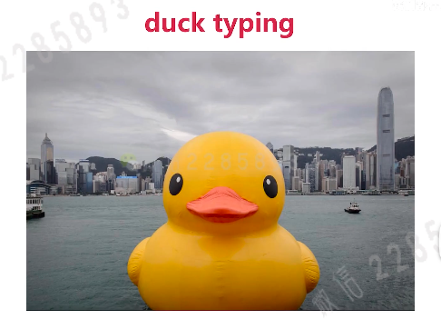

## 接口
是一种行为能力的集合(抽象),他并不是属于谁，是一种对功能的抽象

### 要点
- 一般不实用接口的指针
- 接口中含有指针或者值
- 实现接口中的方法就表示你有了这个接口的功能，你就是这个接口的类型

### 常用系统接口
- Stringer: 相当于其他语言的toString
- Reader/Writer: 读和写的功能

## duck typing

- 这个duck是鸭子吗？
    - 传统类型：脊椎动物亚门，鸟纲雁形目。。。
        > 传统类型一项项的比对下来，这个duck当然不是一个鸭子

    - duck typing: 像鸭子就是一个鸭子(描述事物的外部行为而非内部结构)
        > 从使用者角度理解吃货的世界可能不是一个鸭子，在小朋友眼中的鸭子

- go语言是duck typing吗？

    go语言是类似的duck typing并不是真正意义上的duck typing(需要动态绑定)

- python 中的duck typing

```py
   问题1: 运行时才知道传入的retriever有没有get方法,编译时期是不知道的,写retriver的人并不知道你要download一个retriver的调用get方法
    def download(retriever):
        return retriever.get("www.baidu.com")
   解决1：需要注释(我需要一个能get的reteiver)
```
- c++ 中的duck typing
```c++
   问题1: 编译时期才知道retriever有没有get方法(在敲代码的时候你是不知道的) 
   解决1: 还是要通过注释来解释
```
- go语言中的duck typing(吸取了其他语言的优点)

    - 同时具有python和c++ duck typing的灵活性
    - 同时具有java的类型检查(不需要看注释来解决这个问题)

