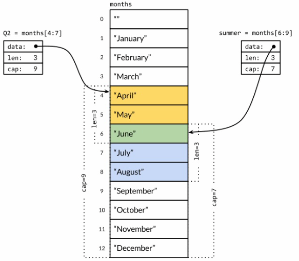

# 数组和切片

1. 数组声明

```go
  var arr [3]int // 声明一个长度为3的int类型的数组元素都是0
  var arr [3]int = [3]int{1,2,3} // 声明一个长度为3的数组并赋值
  arr := [...]int{1, 2, 3} //不指定长度由后面的元素确定 
  var srr = [...]string{1:"hello", 3:"wold"} // 定义一个长度为4的string数组指定索引1，3位置的元素，其他0，2的元素默认空字符串
```
2. slice
切片是一个动态的数组类型本质是一个自定义的类型，存储一系列类型相同的值,包括容量和长度和指针，指针指向切片引用的底层数组，0 <= cap <= len
```go
  var arr []int // 定义一个空的slice
  var arr []int = []int{1,2,3} // 定义一个长度为3的slice
  s :=  []int{1, 2, 3} // 短赋值
  // 序列操作
  s[1:] // 得到从索引为1的位置到最后的子序列(新的切片)
  s[:] // 对整个slice的序列的引用(新的切片)
```
3. 引用


> months 是一个表示月份的切片`Q2和summer`是一个新的切片,**他们都引用者底层同一个数组对象**
```go
  Q2 := months[4:7]
  summer := months[6:9]
  // 此时我们想要删除4月份
  // 使用copy内建函数
  copy(months[4:], months[5:]) 
  // months[4:] 和months[5:]它们也是引用同一个底层的数组,**它们的位置和顺序是一致的** 
 // 相当于months[4:] =  months[5:]
 // 此时的months切片变成了【1月，2月，3月，5月，6月，7月，8月，9月，10月，11月，12月，12月】
  months = months[:len(months) - 1 ]
  fmt.Println(months)
  // 这样我们就达到了删除4月的效果
```
> 由此可以看出copy函数是把源文件的元素拷贝到目标文件(从头开始),源文件有多少个元素就拷贝进目标文件多少个元素,返回拷贝元素的个数

4. slice operation
  * append(slice,cap,len) // add
  * slice[2] = 4 // update
  * slice[:] = 4 // query
 

