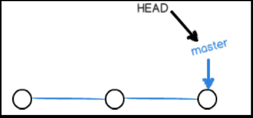
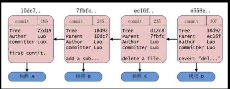

## .gitignore文件
让git忽略(不去追踪)的文件

## 规则
| *.a                | !lib.a    | build/                | doc/*.txt                           | doc/**/*.txt                    | /*,!fish/                    |
|--------------------|-----------|-----------------------|-------------------------------------|---------------------------------|------------------------------|
| 所有以.a结尾的文件 | 除了lib.a | build目录下的所有文件 | 忽略doc/a.txt不包括doc/server/a.txt | doc目录下的所有以.txt结尾的文件 | **忽略所有文件除了fish目录** |

## 分支

默认情况下初始化仓库就会创建一个默认的分支master,实际指向的是提交对象(**每一次的commit中都有上一次commit对象的id的引用**)
一般用于开发上线的分支,svn创建分支是把原来的分支完全的copy一份而git是创建一个分支指针指向commit链并且HEAD指向这个分支指针

| git branch | git checkout 分支名 | git checkout -b 分支名 | git branch -d 分支名   | git branch -D 分支名   | git merge 分支名 | git branch -av           |
|------------|---------------------|------------------------|------------------------|------------------------|------------------|--------------------------|
| 查看分支   | 切换分支            | 创建并切换分支         | 删除分支(分支之间相同) | 删除分支(不管想不相同) | 合并分支         | 查看所有分支信息(远程等) |

**一旦在其他分支提交了文件(让git管理起来)之后,这个分支就和master分支独立了,比如在分支上床架拿了文件并提交,切换master分支是没有这个文件的,并且在master中也看不到其他分支的commit对象**

## HEAD
表示指针指向当前分支

## git merge
当我们在两个分支更改了同一个文件的不同内容的时候合并出现冲突，自动和合并失败需要我们手动解决冲突，解决冲突之后的使用git
add 表示我修复了这个冲突但是还处于为合并状态，使用git commit结束merge
